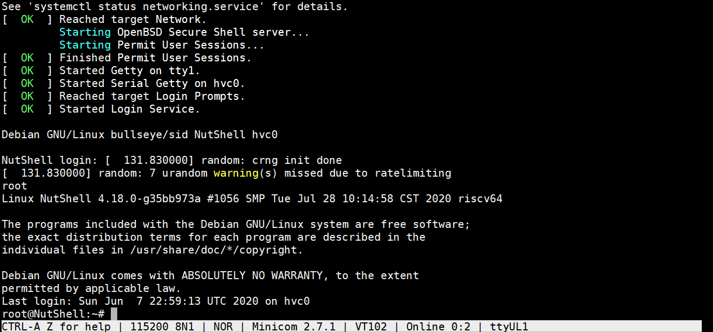

# NutShell (果壳)

NutShell is a processor developed by the OSCPU (Open Source Chip Project by University) team.

Currently it supports riscv64/32.

See [here](https://github.com/OSCPU/NutShell-doc) for the documents.

See [the History and Naming section](#history) for naming issue.

## Demo: [Running Debian on FPGA](debian_on_fpga.gif)



## Compile chisel code

* Install `mill`. Refer to [the Manual section in this guide][mill].
* Run `make` to generate verilog code. The output file is `build/TopMain.v`.

[mill]: https://com-lihaoyi.github.io/mill/ 

## Run programs by simulation

You can either use our ready-to-run image for simulation or build image yourself.

To use ready-to run image (recommended) :

* Run `make emu` to launch simulation. Default image is linux kernel.
* Run `make IMAGE=yourimage.bin emu` to specify your image file. We have provided some in ./ready-to-run.

To build image yourself:

* Set a new environment variable `NEMU_HOME` to the **absolute path** of the [NEMU project](https://github.com/OpenXiangShan/NEMU).
* Set a new environment variable `NUTSHELL_HOME` to the **absolute path** of the NutShell project.
* Clone the [AM project](https://github.com/OSCPU/nexus-am.git).
* Set a new environment variable `AM_HOME` to the **absolute path** of the AM project.
* Run the application in the AM project by `make ARCH=riscv64-nutshell run`.
```
cd nexus-am/apps/microbench
make ARCH=riscv64-nutshell mainargs=test run
```

## Run on FPGA

### Sub-directories Overview
```
fpga
├── board              # supported FPGA boards and files to build a Vivado project
├── boot               # PS boot flow of zynq and zynqmp
├── lib                # HDL sources shared by different boards
├── Makefile
├── Makefile.check
└── NutShell.tcl       # wrapper of NutShell core in the Vivado project
```

### Build a Vivado project

* Install Vivado 2019.1, and source the setting of Vivado and SDK
* Run the following command to build a Vivado project
```
cd fpga
make PRJ=myproject BOARD=pynq STANDALONE=true
```
Change `pynq` to the target board you want. Supported boards are listed under `board/`.
The project will be created under `board/pynq/build/myproject-pynq`. Please note that STANDALONE mode is only used in `pynq` board.

* Open the project with Vivado and generate bitstream.

### Prepare SD card

Refer to the instructions of [fpga/boot/README.md](fpga/boot/README.md).

NOTE: Remember to put the bitstream into BOOT.BIN, since the guide is going to boot everything from SD card.

### Set your board to SD boot mode

Please refer to the user guide of your board.
* [zedboard](http://www.zedboard.org/sites/default/files/ZedBoard_HW_UG_v1_1.pdf)
* [zcu102](https://www.xilinx.com/support/documentation/boards_and_kits/zcu102/ug1182-zcu102-eval-bd.pdf)
* [sidewinder](http://sidewinder.fidus.com)
* ultraZ (currently not avaliable to the public)
* axu3cg (currently not avaliable to the public)

### Boot linux in PS

Just insert the SD card into the board, open a serial terminal and powerup the board.

### Boot NutShell (the RISC-V subsystem)

To boot the RISC-V subsystem
* Send `fpga/resource/ddr-loader/ddr-loader.c` to PS.
This can be achieved by either copying the file to SD card,
or by sending the file with `scp` if you have your board connected to your host by network.
* Compile the loader by gcc on PS.
```
gcc -O2 -o ddr-loader ddr-loader.c
```
* Send the RISC-V program (bin file, should start at 0x80000000) to PS.
* Open minicom on PS to connect to the UART of NutShell.
Note that you can connect to PS via `ssh` and use `tmux` to get multiple terminals.
```
minicom -D /dev/ttyUL1
```
* Use the loader to load the program to NutShell memory and start running NutShell.
```
./ddr-loader $(YOUR_BOARD) bin-file
```
* To shutdown the board, first run `poweroff` in PS.

## <a name="history"></a> History and Naming

**Is NutShell developed from scratch?**

No.
NutShell is originally based on the NOOP project, an educational RV32 SoC designed by Nanjing University (NJU).
At 2019/08/27, the OSCPU team decided to start a new project based on a fork of NOOP.

**Why was there only one contributor in this repo before 2019/08/27?**

NOOP was maintained by [sashimi-yzh](https://github.com/sashimi-yzh) on behalf of NJU before 2019/08/27.

**What is the different between NutShell and NOOP?**

Undergraduate students in the OSCPU team planned to enhance the educational SoC to a fully functional RV64 SoC,
on behalf of University of Chinese Academy of Sciences (UCAS, 中国科学院大学).
The goal was to boot Linux + Debian and tapeout the chip.
Students have put a lot of effort into achieving such a goal.

**Where can I find the original NOOP repo?**

NOOP is designed as a programming assignment for educational purpose.
It is still unstable and may be redesigned every year.
Therefore there is no official release for NOOP yet.

But here are some reference implementations:
* Code in this NutShell repo before 2019/08/27 can be considered as NOOP designed in 2019.
* [Here](https://github.com/nju-mips/noop-lo) is an implementation of NOOP designed by students in NJU at 2018.
This is the CPU design which won the 2nd prize in LoongsonCup18.
It is designed with Chisel, too.
But note that the ISA is mips32, since the contest is held by Loongson.
Also the implementation is very different from the one above.

**Why can I still find the name NOOP in the code as well as the commit logs after 2019/08/27?**

During the development, the OSCPU team has not yet thought of a good name for the SoC.
Before this repo is available to the public, they finally decide to name the SoC NutShell.
In Chinese, NutShell (果壳) and the nickname of UCAS (国科大) are similar in pronunciation.
The name NutShell is welcomed by every student in UCAS.

**I found a name Argo in the code as well as the commit logs. What is it?**

Argo is the name of a dual-issued OoO core designed by [AugustusWillisWang](https://github.com/AugustusWillisWang).
AugustusWillisWang is one of the students who develop NutShell.
Argo is designed based on NutShell, and they share the same SoC architecture.

**I found a name COOSCA in the commit logs. What is it?**

COOSCA is an internal name of the SoC.
Students in the team want a better name, so there comes NutShell.
The name COOSCA should be rarely presented in the repo.
